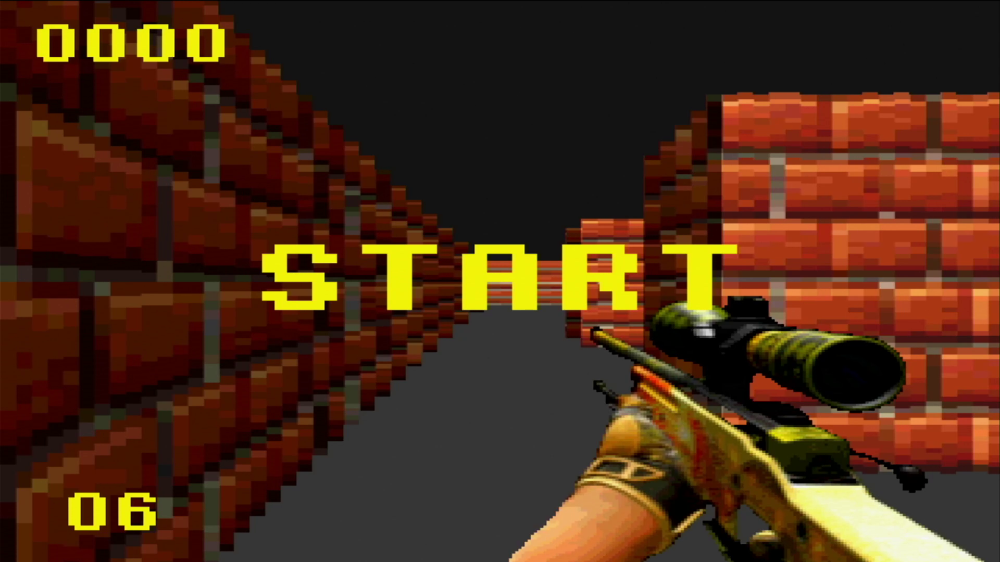
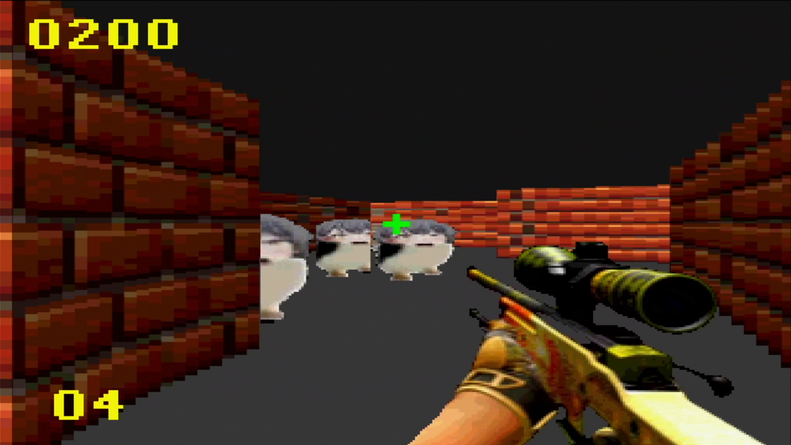
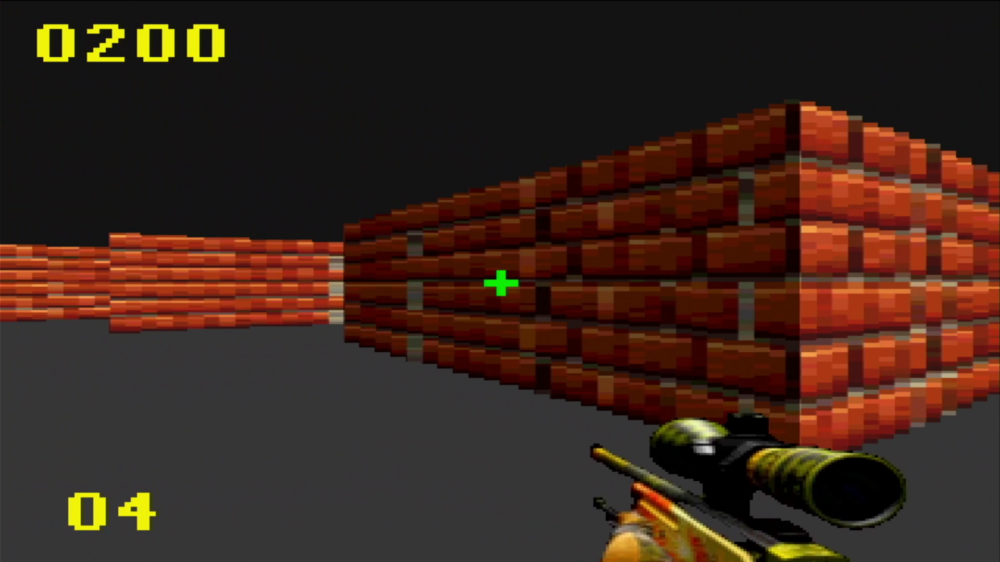
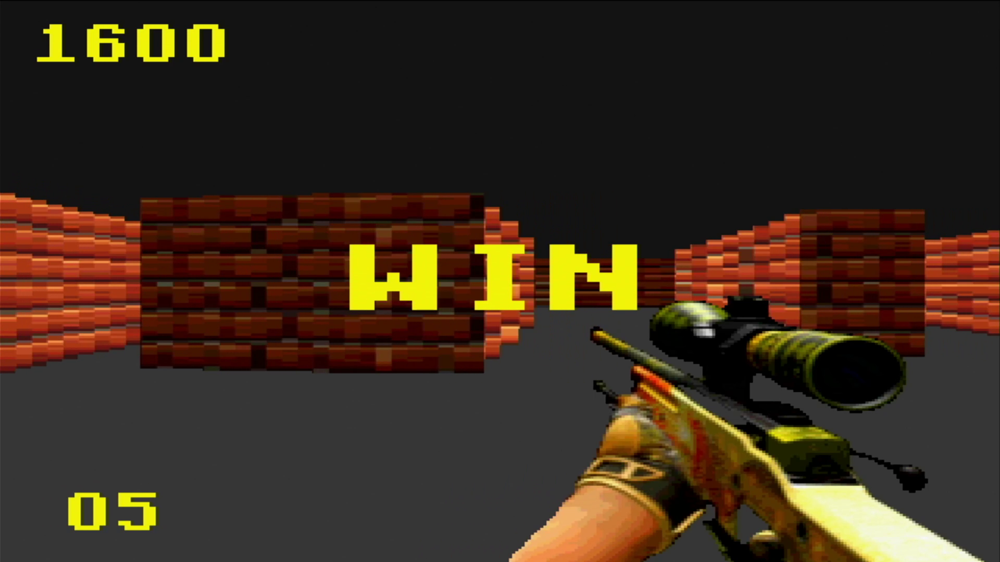
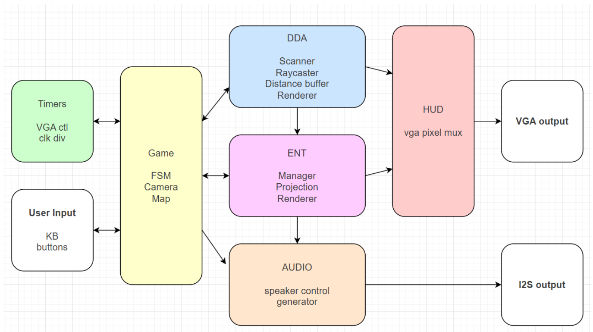
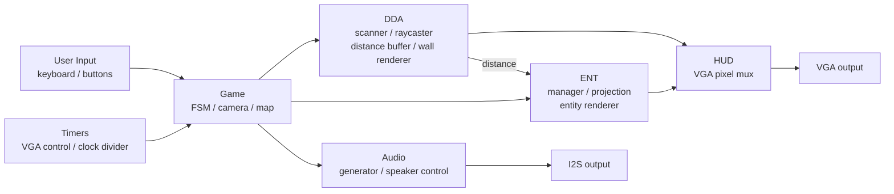

# Hardware-Accelerated 3D Raycasting FPS Game

A first-person shooter rendered entirely in hardware on an FPGA. The engine casts rays with a fixed-point DDA, draws textured walls and sprite entities, plays sound effects over I2S, and drives a 640×480 VGA display at 60 Hz — with no CPU or soft processor involved.

Final project for the Digital Logic Design Lab, Department of Electrical Engineering, National Tsing Hua University (Spring 2026).

[](https://youtu.be/KautMSY55fs)

▶ **[Watch the full demo on YouTube](https://youtu.be/KautMSY55fs)**

| | |
| --- | --- |
|  |  |
|  |  |




## Highlights

- **Fully hardware rendering pipeline**: raycasting, wall rendering, sprite projection and HUD compositing are all custom RTL blocks written in SystemVerilog.
- **No square roots, no divisions at runtime**: ray distances come from DDA step counts multiplied by precomputed `csc` values, and wall heights come from a height ROM indexed by distance.
- **Frame-accurate scheduling**: compute-heavy stages run during the VGA vertical blanking interval, and pixel-generating stages run during active video.
- **Area-aware entity engine**: up to 32 entities are projected one at a time, which cut LUT usage from 102% (fully parallel) to 12%.
- **Sound**: 16-bit, 11.025 kHz gunshot and death effects streamed from ROM over I2S.

## Hardware and Tools

| Item | Detail |
| --- | --- |
| Board | Digilent Basys 3 (Xilinx Artix-7) |
| Language | SystemVerilog |
| Toolchain | Xilinx Vivado |
| Video | VGA 640×480 @ 60 Hz (internal render resolution 320×240) |
| Audio | I2S output, 16-bit @ 11.025 kHz |
| Input | Keyboard and on-board buttons |

## Architecture



| Block | Sub-modules | Role |
| --- | --- | --- |
| **Timers** | `vga_control`, `clk_div` | VGA sync and pixel counters, `v_blank` / `frame_tick` events, audio clocks |
| **Game** | game logic FSM, camera, `map_rom` | Game state (`MENU → PLAY → DEAD → MENU`), player position and angle, collision against the map |
| **DDA** | scanner, raycaster, distance buffer, wall renderer | Casts one ray per screen column, stores `[hit_side, distance]`, draws textured walls |
| **ENT** | manager, projection, entity renderer | Keeps up to 32 entities, projects them to screen space, draws sprites with depth testing against the distance buffer |
| **HUD** | pixel mux | Composites walls, entities and overlay into the final VGA pixel |
| **Audio** | generator, speaker control, `gunshot_rom`, `death_rom` | Plays sound effects triggered by the game logic |

## Design Details

### Fixed-point trigonometry

Angles are stored as an 8-bit value, so one full turn is 256 steps (0 = 0°, 64 = 90°, 128 = 180°, 192 = 270°). Only two lookup ROMs are needed, `sin` and `csc`, both in Q8.8 fixed point. `cos` and `sec` come from the same ROMs by adding a 64-step (90°) offset to the angle, so the design never needs floating point or a second set of tables.

### Raycasting with DDA

- Field of view is 90°, sampled by **64 rays**. Each ray covers a 5-pixel-wide column, giving the 320-pixel internal width (upscaled to 640×480 on output).
- The raycaster steps through the map grid one cell boundary at a time. When it hits a wall after *n* steps, the distance is `init + n × csc(angle)`, so no squares or square roots are needed.
- Results go into a **distance buffer**, one `[hit_side, distance]` entry per column. The wall renderer and the entity renderer both read it.
- The **scanner** (master) and **raycaster** (slave) are two cooperating FSMs:
  - Scanner: `IDLE → PREP → START → WAIT → NEXT`
  - Raycaster: `IDLE → INIT_1 → INIT_2 → STEP → MEM_WAIT → CHK_HIT → CALC_DIST`
  - Each ray takes 7 cycles per DDA step. With 64 rays and at most 16 steps per ray, a frame needs between 452 (4 + 7 × 64) and 7,172 (4 + 7 × 16 × 64) cycles, well within the vertical blanking budget.

### Wall rendering without division

The projected wall height would normally be `actual_height / distance`. A hardware divider was too slow, so the renderer looks the height up directly from a **height ROM indexed by distance**. Hit side and a texture ROM provide shading and wall textures.

### Frame scheduling

The VGA frame has 525 lines, of which 480 are visible. Running at 4 system clocks per pixel:

| Phase | What runs | Budget |
| --- | --- | --- |
| Vertical blanking (45 lines) | DDA scanner/raycaster, entity manager/projection | 45 × 640 × 4 = **115,200 cycles** |
| Active video | Wall renderer, entity renderer, HUD | Pixel by pixel, in lockstep with `show_x` / `show_y` |

Using only the vsync pulse (2 lines, 5,120 cycles) would not have been enough, so the compute stages are triggered by `v_blank`.

### Entity engine: trading time for area

- The first version stored and projected all 32 entities in parallel in a single cycle. It needed **102% of the LUTs** and did not fit.
- The final version has the **manager** feed entities to a single **projection** unit one by one (`IDLE → LOAD → WAIT → SAVE` and `IDLE → WAIT_ROM → CALC`). This takes 171–375 cycles per frame and uses only **12% of the LUTs**.
- Projected, visible entities are packed into an OAM-style buffer (up to 8 entries) for the entity renderer. The renderer compares each sprite pixel with the distance buffer so walls correctly hide entities behind them.

### Audio

The audio generator streams 16-bit samples at 11.025 kHz from `gunshot_rom` and `death_rom` when the game logic fires a `shoot` or `death` event. The speaker controller serializes them over I2S.

## Results

Post-implementation on the Basys 3:

| Resource | Utilization |
| --- | --- |
| LUT | 16% |
| FF | 5% |
| BRAM | 53% |
| DSP | 46% |
| IO | 37% |
| BUFG | 3% |

Total on-chip power is about **0.21 W** (0.136 W dynamic + 0.073 W static). The largest dynamic consumers are the DSP slices (31%) and BRAM (28%).

## Repository Structure

```
.
├── final_proj/   # All RTL sources (.sv / .v): timers, game, DDA, entities, HUD, audio
├── helpers/      # Python helper scripts used during development
├── docs/         # Screenshots and block diagram used in this README
└── .gitignore
```

### Helper scripts

All lookup tables and image/audio assets are precomputed in Python and loaded into ROM, so the hardware never computes trigonometry, divisions or decodes media at runtime.

| Script | Generates |
| --- | --- |
| `sin_mem_gen.py` | Sine table for the 8-bit angle (256 steps per turn), Q8.8 fixed point; cosine reuses it with a 90° (64-step) offset |
| `csc_mem_gen.py` | Cosecant table used for DDA step distances; secant reuses it with the same 90° offset |
| `height_lut_gen.py` | Distance → projected wall height lookup table (replaces runtime division) |
| `wall_mem_gen.py` | Wall texture ROM |
| `entity_mem_gen.py` | Enemy sprite texture ROM |
| `gun_mem_gen.py` | First-person weapon sprite for the HUD |
| `audio_mem_gen.py` | 16-bit, 11.025 kHz gunshot and death sound ROMs |

## Build and Run

1. Open Vivado and create a project for the Basys 3 (`xc7a35tcpg236-1`).
2. Add all `.sv` and `.v` files under `final_proj/` as design sources, together with the Basys 3 constraint file.
3. Run synthesis, implementation and bitstream generation, then program the board.
4. Connect a VGA monitor, an I2S audio module and the keyboard.

## Author

Yu-Kai Tsao (曹嵎榿) — Department of Electrical Engineering, National Tsing Hua University
